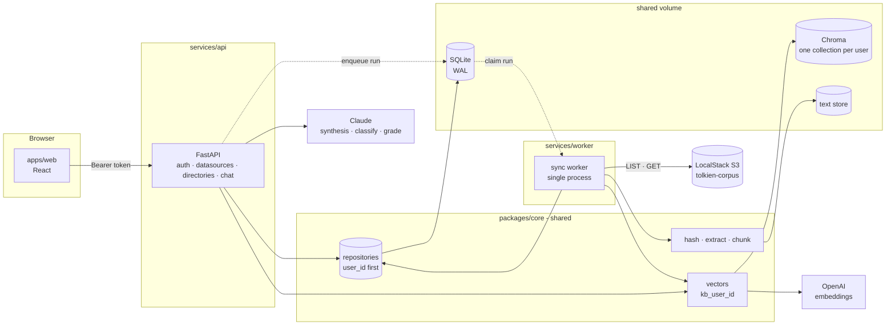
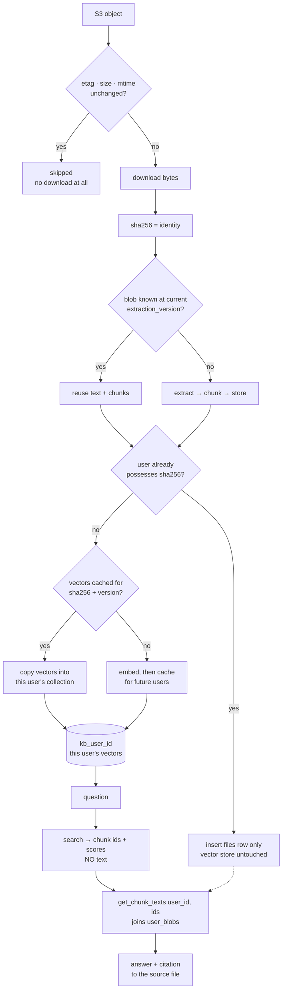
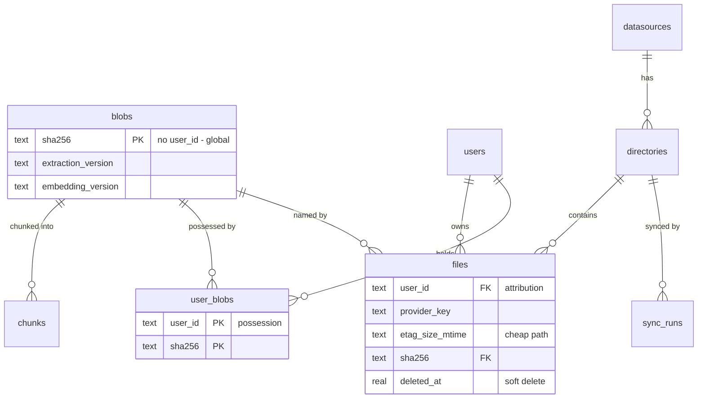
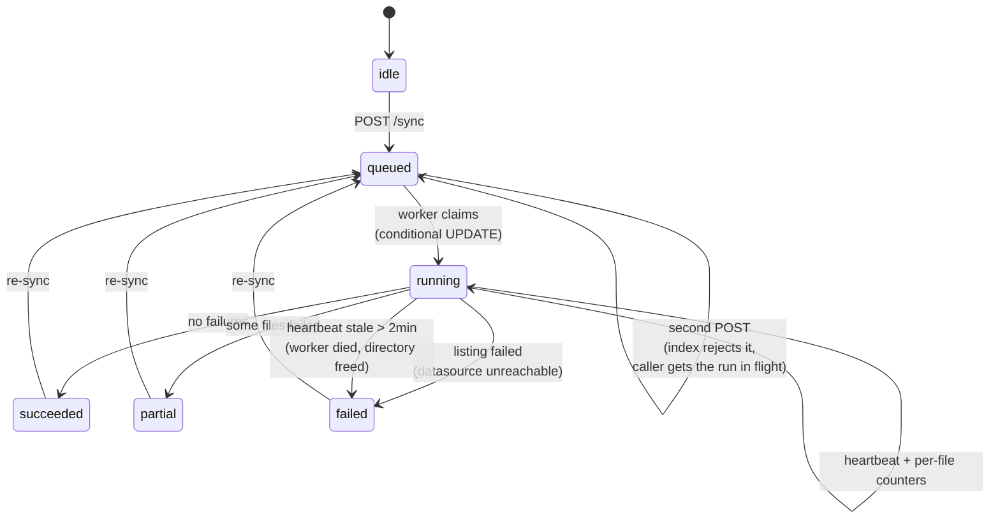

# Architecture

Three diagrams: what runs, how a document becomes an answer, and how a sync run moves between
states.

## Services

Two entrypoints over one codebase. The split exists so a long sync cannot take the request path
down with it, and so the worker can be restarted independently — not because the two are different
applications.

The API never calls the worker and the worker never calls the API. They meet only in the database:
the API writes a `queued` run, the worker claims it with a conditional `UPDATE`. Dependencies run
one way — `services/*` may import `core`, `core` never imports `services`.

## Data flow: object to citation

The two-stage read is the point of the bottom half. Search returns ids; text only ever comes from a
user-scoped lookup. A vector that somehow surfaced from another tenant's collection resolves to
nothing and drops out before it can reach a prompt.

### The three tables that carry the model

`blobs` is identity, `files` is attribution, `user_blobs` is possession. Keeping the three apart is
what makes a cross-tenant cache safe: a hit crosses tenants only on identity, and nothing about
another user's attribution is reachable from a sha256.

## Sync lifecycle

Every transition is a database write. There is no in-memory state machine, which is what makes each
awkward case answerable by reading a row.

| Case | What happens | Test |
|---|---|---|
| Double click | Partial unique index on `sync_runs(directory_id)` where state is queued/running rejects the second insert; that caller is handed the run already in flight. | `test_second_sync_request_returns_the_run_already_in_flight` |
| Refresh mid-run | Counters are written per file, so progress is read from the database, not process memory. | `test_counters_are_readable_from_the_database_during_a_run` |
| Dead worker | `heartbeat_at` older than two minutes is reclaimed as `failed`, freeing the directory. | `test_a_run_whose_worker_died_is_reclaimed_and_the_directory_freed` |
| One bad file | Per-file failure increments a counter and continues; the run ends `partial`. | `test_one_unreadable_file_does_not_abort_the_run` |
| Deleted at source | Anything absent from the listing is soft deleted through the same path as manual removal. | `test_a_file_removed_at_the_source_is_soft_deleted_and_unindexed` |
| Nothing new | A `succeeded` run with `files_new = 0`. Falls out of the states rather than being special-cased. | `test_resync_of_an_unchanged_directory_downloads_nothing` |

## Removal

Soft delete the `files` row. Drop that content's vectors from the user's collection **only when no
other live file row of the same user references the same sha256** — the same content can arrive
under several names or in several directories. `blobs`, `chunks`, and the embedding cache persist:
they are content, not attribution. Answers stop citing the file immediately.

The sync worker's "deleted at source" path and the manual `DELETE /files/{id}` route run the same
rule, so the two cannot drift apart.
